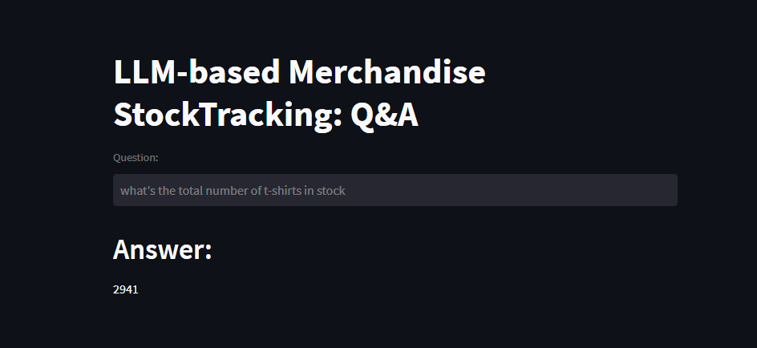

# LLM-for-Retail-Stock-Tracking
This project builds an application that leverages LLM to query stock information by simply asking a question as shown below. It's also capable of few-shot learning by appending 'few_shot_learning.py' file with text questions, SQL queries and answers.

In order to run this repository, follow the steps below:

1. Clone this repository to local folder
2. Run MySQL database using provided database
3. Open terminal in the repository folder
4. Type "streamlit run main.py" then press Enter
5. The UI below will pop up
6. Enjoy the power of LLM + Langchain!

Credit: https://www.youtube.com/@codebasics
